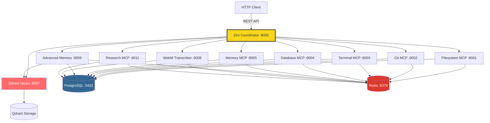
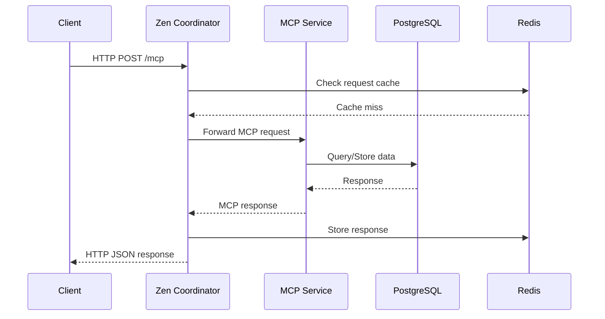
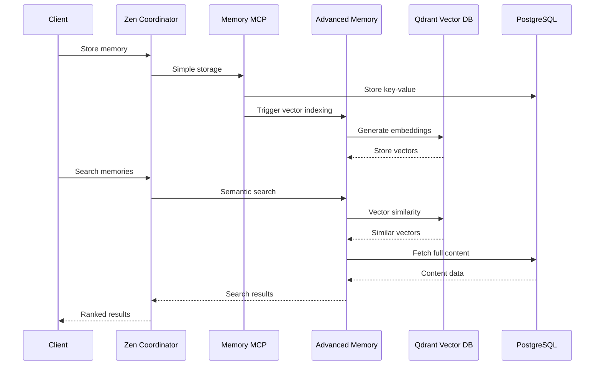
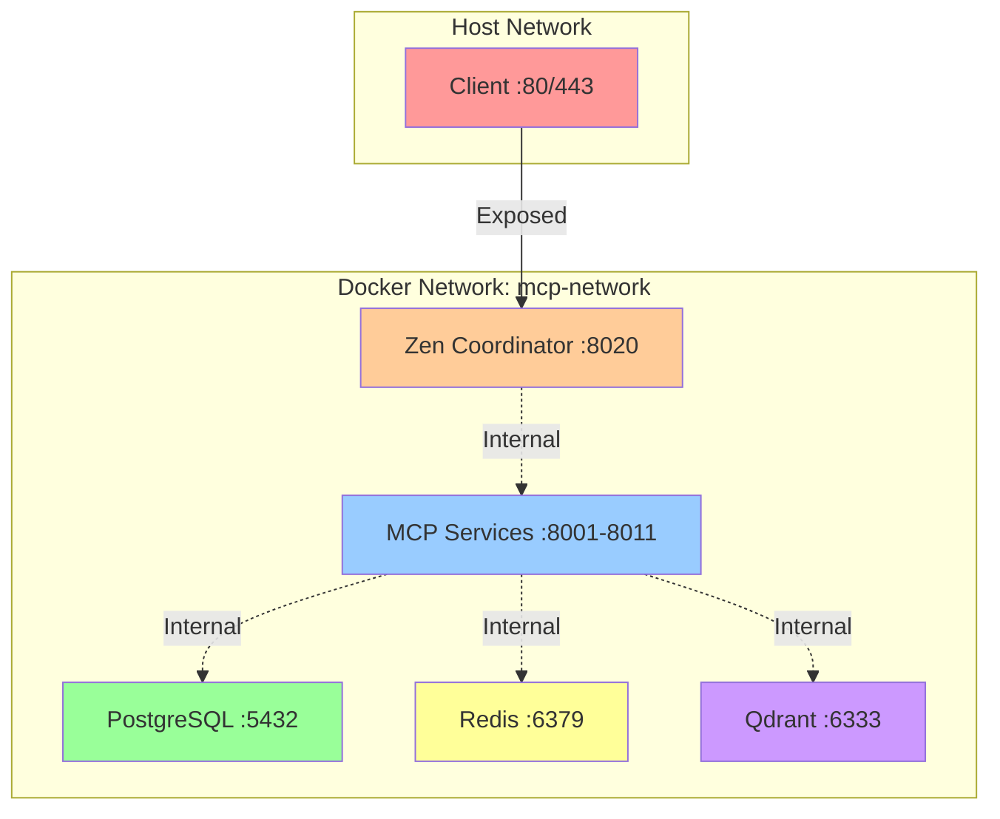
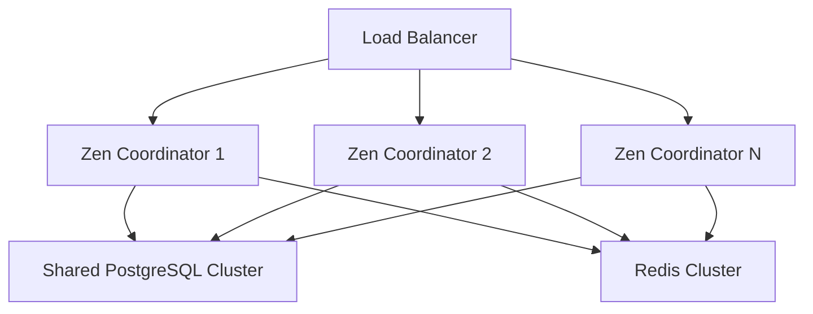
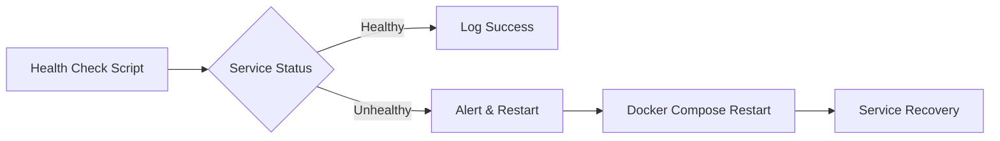
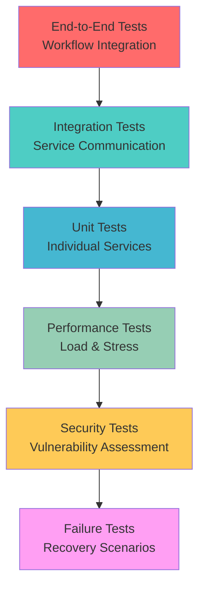

# 🏗️ Architecture Deep Dive

## System Overview

The MCP Orchestration System implements a **service mesh architecture** with a central coordinator that provides HTTP-to-MCP protocol translation.

## Data Flow Architecture

### Request Processing Flow

### Memory & Vector Search Flow

## Service Architecture Details

### Zen Coordinator (Port 8020)
- **Role**: HTTP ↔ MCP Protocol Bridge
- **Features**:
  - Request routing based on tool name
  - Protocol translation (HTTP JSON ↔ MCP)
  - Health monitoring of all services
  - Centralized logging and metrics
  - Redis-based response caching

### MCP Services Layer
Each MCP service is containerized with:
- **Shared Database**: PostgreSQL connection
- **Shared Cache**: Redis connection  
- **Individual Ports**: 8001-8011 range
- **Fault Isolation**: Container-level isolation
- **Auto-restart**: Docker Compose restart policies

### Data Persistence Layer
- **PostgreSQL**: Primary data store, ACID compliance
- **Redis**: High-speed caching, session storage
- **Qdrant**: Vector embeddings, similarity search
- **File System**: Document storage, workspace data

## Security Architecture

### Network Security

### Authentication & Authorization
- **Environment Variables**: All secrets via .env
- **Container Isolation**: Service-level boundaries
- **Database Authentication**: PostgreSQL user/password
- **API Key Management**: External service tokens
- **Network Segmentation**: Docker internal network

## Scalability Patterns

### Horizontal Scaling

### Vertical Scaling
- **Resource Limits**: Docker container constraints
- **Database Scaling**: PostgreSQL connection pooling
- **Cache Optimization**: Redis memory management
- **Vector Search**: Qdrant index optimization

## Monitoring & Observability

### Health Check Architecture

### Metrics Collection
- **Service Health**: HTTP endpoint monitoring
- **Database Performance**: PostgreSQL query metrics
- **Cache Hit Rates**: Redis performance stats
- **Vector Search**: Qdrant index statistics
- **Resource Usage**: Docker container metrics

## Development Architecture

### Testing Pyramid

### CI/CD Pipeline (Recommended)
1. **Code Commit** → Trigger pipeline
2. **Unit Tests** → Individual service testing
3. **Integration Tests** → Service communication
4. **Security Scan** → Vulnerability assessment
5. **Performance Tests** → Load benchmarking
6. **Build Images** → Docker container creation
7. **Deploy Staging** → Environment testing
8. **Production Deploy** → Blue-green deployment

This architecture ensures **scalability**, **maintainability**, and **production readiness** for enterprise deployments.